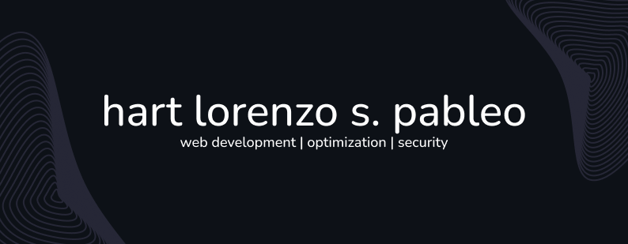

- 👋 Hi, I’m Hart Lorenzo S. Pableo! Welcome to my profile!
--------
- I'm a passionate web developer with a keen interest in technology and coding. When I'm not writing code, you can find me reconnecting with nature and also watching my favorite movies and shows.
--------
- I have a great passion in not just learning "cool" or "new" tools/languages, but also in making sure that I develop the right mindset in becoming a senior engineer where I believe it is more than just what coding languages you know but also how well can you solve problems, how well can you determine both current and potential problems, how well you can work with a team, and also build projects that have the capability to survive in the long term (good code practices, easy-to-understand structure, scalable design, and more!).
--------
- Currently, my development journey is centered around Drupal and WordPress, working on both the front-end and back-end of both systems. However, I'm also on a path towards becoming a Full-Stack developer with a focus on PHP. Join me as I embrace the world of web development and create innovative solutions!
--------
- 📫 How to reach me:  
  Email: <a href="mailto:pableoh@gmail.com">pableoh@gmail.com</a>  
  LinkedIn: <a href="https://www.linkedin.com/in/hart-pableo-05ab81207/" target="_blank">Hart Pableo</a>
  X: <a href="https://x.com/PableoHart" target="_blank">@PableoHart</a>

<!---
hartpableo/hartpableo is a ✨ special ✨ repository because its `README.md` (this file) appears on your GitHub profile.
You can click the Preview link to take a look at your changes.
--->
